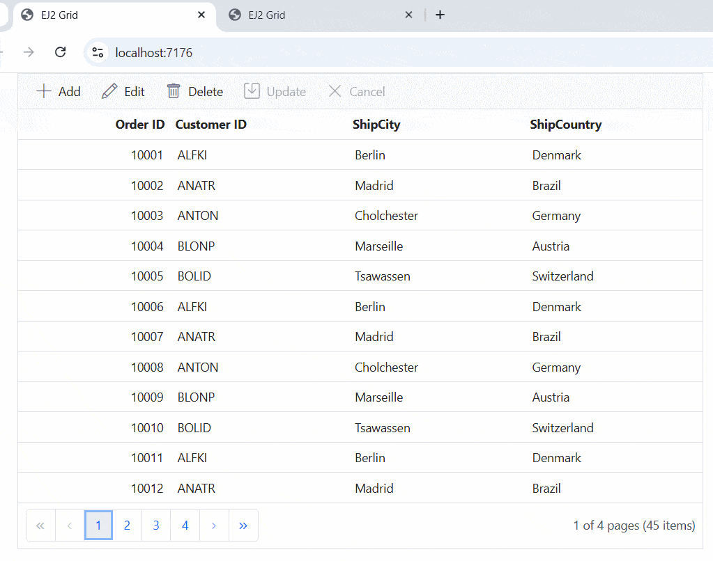

# Binding data with SignalR in ej2 typescript grid

This repository demonstrates the integration of SignalR with the Syncfusion EJ2 TypeScript Grid, enabling real-time data binding. This feature is especially useful for applications that need live updates and multi-client synchronization.

## Features

**Real-Time Data Synchronization**:  Automatically updates the grid data across all connected clients using SignalR.

**Remote Data Integration:** Bind data to the Syncfusion EJ2 Grid using the DataManager adaptor.

**CRUD Operations:** Implement Create, Read, Update, and Delete operations.

## Prerequisites

Before you begin, ensure you have met the following requirements:

* Node.js and npm installed

* Basic knowledge of TypeScript and web development

## Getting Started

**1. Clone the Repository:**

Use `git clone` to fetch the repository from GitHub.

```bash
https://github.com/SyncfusionExamples/Binding-data-with-SignalR-in-ej2-typescript-grid.git
```

**2. Open and Build the Project:**

* Open the project in Visual Studio.
* Build the project to restore dependencies and compile it.
* Run the project

**3. Explore the Code:**

* Navigate to TypeScript files (typically in src or scripts).
* Debug and interact with the code as needed.



## Resources

You can also refer the below resources to know more details about Syncfusion Typescript Grid components.

* [Demo](https://ej2.syncfusion.com/demos/#/bootstrap/grid/over-view)
* [Documentation](https://ej2.syncfusion.com/documentation/grid/getting-started)
* [UrlAdaptor with Syncfusion DataManager](https://ej2.syncfusion.com/documentation/grid/connecting-to-adaptors/url-adaptor)